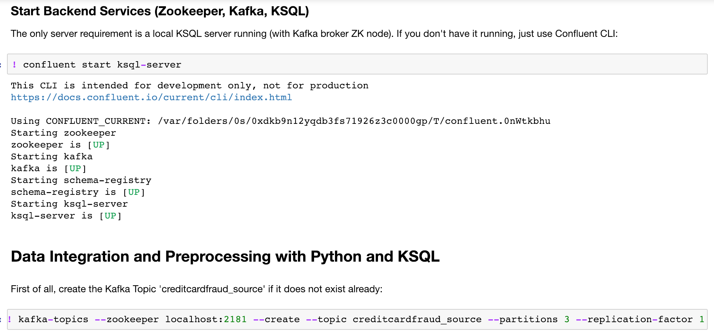
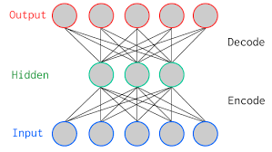
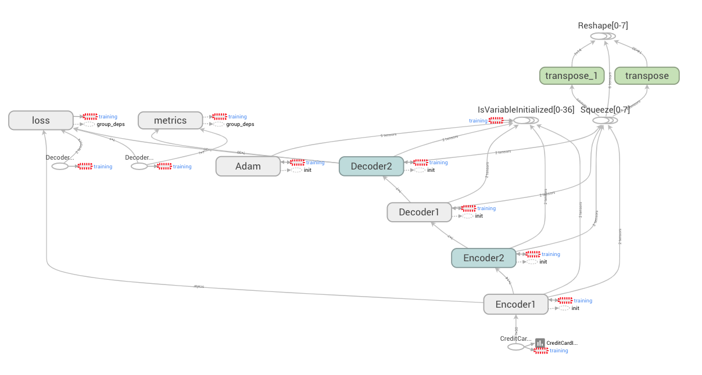

# Technology: Python, Jupyter, TensorFlow, Keras, Apache Kafka, KSQL 

This project shows a demo which combines

- simplicity of data science tools (Python, Jupyter notebooks, NumPy, pandas)
- powerful Machine Learning / Deep Learning frameworks (TensorFlow, Keras)
- reliable, scalable event-based streaming technology for production deployments (Apache Kafka, Kafka Connect, KSQL).

If you want to learn more about the relation between the Apache Kafka open source ecosystem and Machine Learning, please check out these two blog posts:

- [How to Build and Deploy Scalable Machine Learning in Production with Apache Kafka](https://www.confluent.io/blog/build-deploy-scalable-machine-learning-production-apache-kafka/)
- [Using Apache Kafka to Drive Cutting-Edge Machine Learning](https://www.confluent.io/blog/using-apache-kafka-drive-cutting-edge-machine-learning)

# Use Case: Fraud Detection for Credit Card Payments

We use test data set from Kaggle as foundation to train an unsupervised autoencoder to detect anomalies and potential fraud in payments. 

Focus of this project is not just model training, but the whole Machine Learning infrastructure including data ingestion, data preprocessing, model training, model deployment and monitoring. All of this needs to be scalable, reliable and performant.

## Requirements

- Python (tested with 3.6)
- Java 8+ (tested with Java 8)
- [Confluent Platform 5.0+ using Kafka + KSQL](https://www.confluent.io/download/) (tested with 5.1)
- [ksql-python](https://github.com/bryanyang0528/ksql-python) (tested with Github release 5.x released on 2018-10-12)

### ksql-python Installation

If you have problems installing ksql-python in your environment via 'pip install ksql', use the commands described in the Github project instead. 

After installation, for some reason, the 'from ksql import KSQLAPI' statement did not work with Python 2.7.x in my Jupyter notebook (but in Mac terminal), so I used Python 3.6 (which also worked in Jupyter).

## Live Demo using KSQL and Keras / TensorFlow from Jupyter Notebook

We will do the following:

1) *Data Integration (Kafka Connect)*: Integrate a stream of data from CSV file or continuous data stream (in real world you can connect directly to an existing Kafka stream from the Jupyter notebook). As alternative, you can create new events manually in command line
2) *Data Preprocessing (KSQL)*: Preprocess the data, e.g. filter, anonymize, aggreate / concatenate
3) *Machine Learning specific preprocessing (NumPy, pandas, Scikit-learn): Normalize, split train / test data
4) *Model Training (TensorFlow + Keras)*
5) *Model Deployment (KSQL + Tensorflow)*
6) *Monitoring of Model Behaviour (KSQL)* like accuracy and performance 

While all of this can be done in a Jupyter notebook for interactive analysis, we can then deploy the same pipeline to production at scale. For instance, you can re-use the KSQL preprocessing statements and run them in your production infrastructure to do model inference with KSQL and the TensorFlow model at scale on new incoming event streams.

### Streaming Analytics and Preprocessing with KSQL using a Jupyter notebook

Interactive analysis and data-preprocessing with Python and KSQL:

### Step-By-Step Guide

Check out [this step-by-step guide](https://github.com/kaiwaehner/python-jupyter-apache-kafka-ksql-tensorflow-keras/blob/master/live-demo___python-jupyter-apache-kafka-ksql-tensorflow-keras.adoc) to start the backend and notebook. The main demo is running in the Jupyter notebook 'python-jupyter-apache-kafka-ksql-tensorflow-keras.ipynb' afterwards.

### Separation between Apache Kafka Administration and KSQL Statements

You can either do everything within Jupyter or separate administration commands such as starting backends or creating Kafka Topics to command line and only run KSQL commands in Jupyter. 

Here is an example where even the Kafka administration in done in Jupyter:

# Additional Information (AutoEncoder, TensorBoard, TensorFlow Model Export / Import)

The following describes some more details of this project like the concept of an Autoencoder, visualisation with TensorBoard and issues with exporting / importing TensorFlow models in different environments.

## Autoencoder for Credit Card Fraud Detection build with Keras and TensorFlow

An autoencoder is an unsupervised neural network which encodes (i.e. compresses) the input and then decodes (i.e. decompresses) it again:

The goal is to lose as little information as possible. This way we can use an autoencoder to detect anomalies if the decoding cannot reconstruct the input well (showing potential fraud).  

## Hands-On with Python, TensorFlow, Keras, Apache Kafka and KSQL

We use KSQL for preprocessing, Numpy, pandas and scikit-learn for ML-specific tasks like array shapes or splitting training and test data, TensorFlow + Keras for model training, and Kafka Streams or KSQL for model deployment and monitoring.

Here is a TensorBoard screenshot of the trained Autoencoder:

## TensorFlow Model Serialisation - Keras model (.h5) vs. TensorFlow model (.pb)

Different model serialisation mechanisms exist. Also product vendors and cloud providers add additional features (like for any other standard). Therefore, your TensorFlow model might not work everywhere out-of-the-box. 

This will probably get better with release of [TensorFlow 2.0](https://medium.com/tensorflow/standardizing-on-keras-guidance-on-high-level-apis-in-tensorflow-2-0-bad2b04c819a) in 2019, but as of today (January 2019), you need to think about where you want to deploy your model before you train and export it.

This demo uses plain Keras API. This is fine e.g. if you want to load the model via Java API from a Java application (see e.g. my [Kafka Streams + Keras + TensorFlow example](https://github.com/kaiwaehner/kafka-streams-machine-learning-examples/blob/master/src/test/java/com/github/megachucky/kafka/streams/machinelearning/test/Kafka_Streams_TensorFlow_Keras_Example_IntegrationTest.java) where I load the H5 model file). 

If you want to deploy the model in a specific TensorFlow infrastructure like Google ML Engine (based on TensorFlow Serving model server), it is best to train the model with GCP's tools as described in this [Google ML Getting Started] (https://cloud.google.com/ml-engine/docs/tensorflow/getting-started-training-prediction) guide.

Otherwise, you need to convert the H5 Keras file to a TensorFlow Proto Buffers file and fulfil some more tasks, e.g. described in this [blog post](https://medium.com/google-cloud/serve-keras-models-using-google-cloud-machine-learning-services-910912238bf6).

The Python tool [Keras to TensorFlow](https://github.com/amir-abdi/keras_to_tensorflow) is a good and simple solution:

                python keras_to_tensorflow.py --input_model="/Users/kai.waehner/git-projects/python-jupyter-apache-kafka-ksql-tensorflow-keras/models/autoencoder_fraud.h5" --output_model="/Users/kai.waehner/git-projects/python-jupyter-apache-kafka-ksql-tensorflow-keras/models/autoencoder_fraud.pb"

The tool freezes the nodes (converts all TF variables to TF constants), and saves the inference graph and weights into a binary protobuf (.pb) file.

You can also use keras.estimator.model_to_estimator (included in tf.keras): [Example](https://www.kaggle.com/yufengg/emnist-gpu-keras-to-tf)