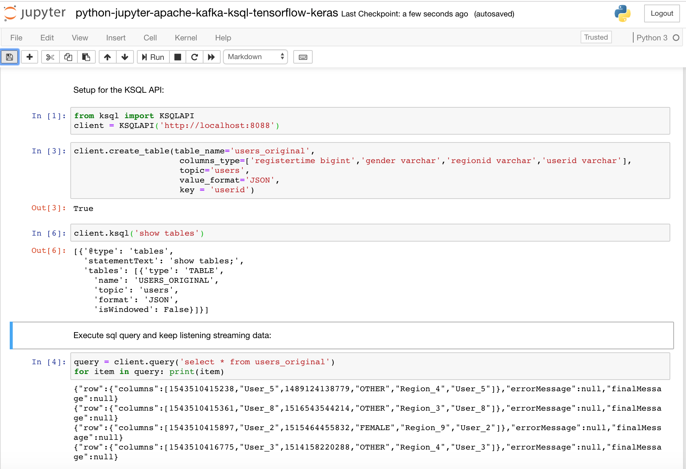

# Work in progress - NOT READY YET

Building a demo which combines

- simplicity of data science tools* (Python, Jupyter notebooks, NumPy, etc)
- powerful Machine Learning / Deep Learning frameworks* (TensorFlow, Keras, etc)
- reliable, scalable event-based streaming technology* for production deployments (Apache Kafka, KSQL).

## Requirements

- Python (tested with 2.7)
- Java 8+ (tested with Java 8)
- [Confluent Platform 5.0+ using Kafka + KSQL](https://www.confluent.io/download/) (tested with 5.0)
- [ksql-python](https://github.com/bryanyang0528/ksql-python) (tested with Github release 5.x released on 2018-10-12)

## Step-by-step guide

Check out [these steps](https://github.com/kaiwaehner/python-jupyter-apache-kafka-ksql-tensorflow-keras/blob/master/live-demo___python-jupyter-apache-kafka-ksql-tensorflow-keras.adoc) to start the backend and notebook. The main demo is running in the Jupyter notebook then.

## Autoencoder for Credit Card Fraud Detection build with Keras and TensorFlow

An autoencoder is an unsupervised neural network which encodes (i.e. compresses) the input and then decodes (i.e. decompresses) it again:

The goal is to lose as little information as possible. This way we can use an autoencoder to detect anomalies if the decoding cannot reconstruct the input well (showing potential fraud).  

## Hands-On with Python, TensorFlow, Keras, Apache Kafka and KSQL

We use KSQL for preprocessing, Numpy and scikit-learn for ML-specific tasks like array shapes or splitting training and test data, TensorFlow + Keras for model training, and Kafka Streams or KSQL for model deployment.

Here is a TensorBoard screenshot of the Autoencoder:

## Apache Kafka and KSQL within a Jupyter notebook

Interactive analysis and data-preprocessing with Python and KSQL:

## Keras model (.h5) vs. TensorFlow model (.pb)

If you want to deploy the model in a TensorFlow infrastructure like Google ML Engine, it is best to train the model with GCP's tools as describe in this [Google ML Getting Started] (https://cloud.google.com/ml-engine/docs/tensorflow/getting-started-training-prediction) guide.

Otherwise you need to convert the H5 Keras file to a TensorFlow Protobuffers file and fulfil some more tasks, e.g. described in this [blog post](https://medium.com/google-cloud/serve-keras-models-using-google-cloud-machine-learning-services-910912238bf6).

The Python tool [Keras to TensorFlow](https://github.com/amir-abdi/keras_to_tensorflow) is a good and simple solution:

                python keras_to_tensorflow.py --input_model="/Users/kai.waehner/git-projects/python-jupyter-apache-kafka-ksql-tensorflow-keras/models/autoencoder_fraud.h5" --output_model="/Users/kai.waehner/git-projects/python-jupyter-apache-kafka-ksql-tensorflow-keras/models/autoencoder_fraud.pb"

The tool freezes the nodes (converts all TF variables to TF constants), and saves the inference graph and weights into a binary protobuf (.pb) file.